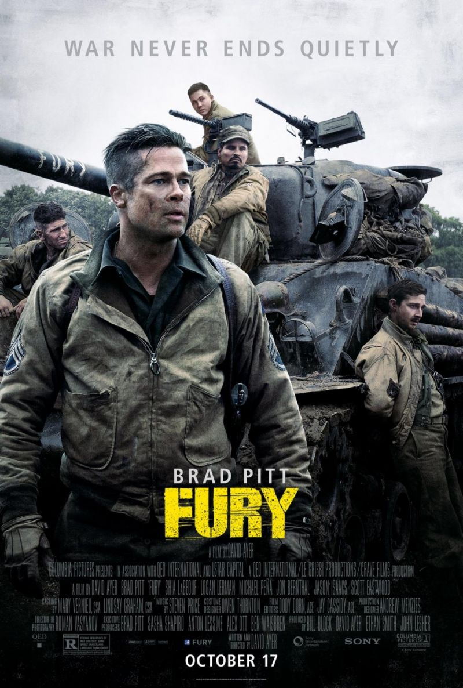

<!DOCTYPE html>
<html lang="en">
<head>
    <meta charset="UTF-8">
    <meta name="viewport" content="width=device-width, initial-scale=1.0">
</head>
<body>
    
<h1>Fury</h1>

In april 1945 tijdens de Tweede Wereldoorlog beginnen vijf soldaten van het Amerikaanse leger met een tank aan een levensgevaarlijke missie op vijandelijke bodem 

om in de kern van Nazi-Duitsland binnen te dringen, waarbij ze in elk opzicht in de minderheid zijn. Deze missie werd geleid door de 2nd Armored Division-sergeant Wardaddy met een M4A2E8 genaamd Fury.

<h2>Bronvermelding</h2>

https://nl.wikipedia.org/wiki/Fury_(2014)

Felix heeft deze readme aangevuld

</body>
</html>
